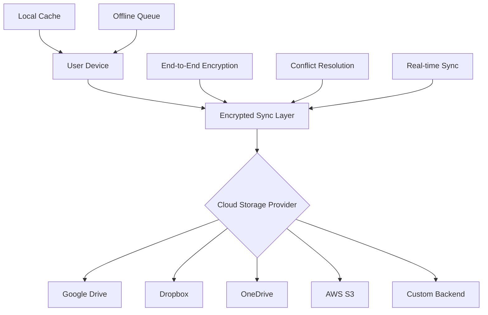

# ☁️ Cloud Storage as Primary Storage Architecture

## 🎯 Vision: Cloud-First Health Data Management

Transform Biomarkr from a local-first to a **cloud-first application** while maintaining privacy, security, and user control over their health data.

## 🏗️ Architecture Overview



## 🔐 Security-First Cloud Storage

### **Zero-Knowledge Architecture**
- All data encrypted on device before cloud upload
- Cloud providers never see unencrypted health data
- User controls encryption keys
- Perfect forward secrecy for all communications

```typescript
interface EncryptedHealthRecord {
  id: string;
  encryptedData: string;        // AES-256 encrypted health data
  encryptedKey: string;         // RSA encrypted data key
  metadata: {
    version: string;
    timestamp: string;
    checksum: string;
    deviceId: string;
  };
}
```

### **Multi-Layer Encryption**
```typescript
// 1. Data encryption (AES-256)
const dataKey = crypto.getRandomValues(new Uint8Array(32));
const encryptedData = await crypto.subtle.encrypt(
  { name: "AES-GCM" },
  dataKey,
  new TextEncoder().encode(JSON.stringify(healthData))
);

// 2. Key encryption (RSA-OAEP)
const encryptedDataKey = await crypto.subtle.encrypt(
  { name: "RSA-OAEP" },
  userPublicKey,
  dataKey
);

// 3. Transport encryption (TLS 1.3)
// Handled by cloud provider APIs
```

## 🌐 Multi-Cloud Strategy

### **Provider Abstraction Layer**
```typescript
interface CloudStorageProvider {
  name: string;
  upload(data: EncryptedRecord): Promise<string>;
  download(id: string): Promise<EncryptedRecord>;
  list(): Promise<string[]>;
  delete(id: string): Promise<void>;
  sync(): Promise<SyncResult>;
}

class GoogleDriveProvider implements CloudStorageProvider {
  // Google Drive specific implementation
}

class DropboxProvider implements CloudStorageProvider {
  // Dropbox specific implementation
}

class CustomBackendProvider implements CloudStorageProvider {
  // Custom server implementation
}
```

### **Smart Provider Selection**
```typescript
class CloudStorageManager {
  async selectOptimalProvider(): Promise<CloudStorageProvider> {
    const factors = {
      speed: await this.measureLatency(),
      cost: this.calculateStorageCost(),
      privacy: this.getPrivacyRating(),
      reliability: this.getUptimeStats(),
      userPreference: this.getUserPreference()
    };
    
    return this.algorithms.selectBest(factors);
  }
}
```

## 📊 Data Architecture

### **Health Data Structure**
```typescript
interface CloudHealthProfile {
  id: string;
  owner: string;                // User identifier (hashed)
  profiles: EncryptedProfile[]; // Family members
  testResults: EncryptedTestResult[];
  reminders: EncryptedReminder[];
  settings: EncryptedSettings;
  metadata: {
    version: string;
    lastModified: string;
    deviceFingerprint: string;
    syncStatus: SyncStatus;
  };
}

interface SyncManifest {
  version: string;
  devices: DeviceInfo[];
  conflicts: ConflictRecord[];
  lastSync: Record<string, string>; // device -> timestamp
  pendingChanges: ChangeLog[];
}
```

### **Conflict Resolution System**
```typescript
class ConflictResolver {
  async resolveConflicts(
    localData: HealthRecord,
    cloudData: HealthRecord
  ): Promise<HealthRecord> {
    // 1. Timestamp-based resolution
    if (localData.lastModified > cloudData.lastModified) {
      return localData;
    }
    
    // 2. Field-level merging for compatible changes
    if (this.areCompatible(localData, cloudData)) {
      return this.mergeRecords(localData, cloudData);
    }
    
    // 3. User intervention for complex conflicts
    return this.requestUserResolution(localData, cloudData);
  }
  
  private areCompatible(a: HealthRecord, b: HealthRecord): boolean {
    // Check if changes don't overlap
    return !this.hasOverlappingChanges(a, b);
  }
}
```

## 🔄 Real-Time Synchronization

### **Event-Driven Sync**
```typescript
class RealTimeSyncEngine {
  private websocket: WebSocket;
  private changeQueue: HealthDataChange[] = [];
  
  async initializeSync() {
    // 1. Establish secure WebSocket connection
    this.websocket = new WebSocket(
      `wss://sync.biomarkr.com/user/${userId}`,
      { headers: { Authorization: `Bearer ${encryptedToken}` } }
    );
    
    // 2. Handle incoming changes
    this.websocket.onmessage = (event) => {
      const change = this.decrypt(event.data);
      this.applyRemoteChange(change);
    };
    
    // 3. Send local changes
    this.watchLocalChanges();
  }
  
  private async watchLocalChanges() {
    // Monitor localStorage changes
    window.addEventListener('storage', (event) => {
      if (event.key?.startsWith('biomarkr-')) {
        this.queueChange({
          key: event.key,
          oldValue: event.oldValue,
          newValue: event.newValue,
          timestamp: Date.now()
        });
      }
    });
  }
}
```

### **Offline-First with Sync**
```typescript
class OfflineFirstManager {
  private syncQueue: SyncOperation[] = [];
  
  async saveHealthData(data: HealthRecord): Promise<void> {
    // 1. Always save locally first
    await this.localStorage.save(data);
    
    // 2. Queue for cloud sync
    this.syncQueue.push({
      operation: 'save',
      data: data,
      timestamp: Date.now(),
      retryCount: 0
    });
    
    // 3. Attempt immediate sync if online
    if (navigator.onLine) {
      this.processSyncQueue();
    }
  }
  
  async processSyncQueue(): Promise<void> {
    while (this.syncQueue.length > 0) {
      const operation = this.syncQueue.shift()!;
      try {
        await this.cloudSync.execute(operation);
      } catch (error) {
        // Retry with exponential backoff
        if (operation.retryCount < 3) {
          operation.retryCount++;
          this.syncQueue.unshift(operation);
          await this.delay(Math.pow(2, operation.retryCount) * 1000);
        }
      }
    }
  }
}
```

## 👥 Multi-Device & Sharing

### **Family Health Management**
```typescript
interface FamilyHealthVault {
  vaultId: string;
  owner: UserId;
  members: FamilyMember[];
  sharedProfiles: SharedProfile[];
  permissions: PermissionMatrix;
}

interface SharedProfile {
  profileId: string;
  sharedWith: UserId[];
  permissions: {
    read: boolean;
    write: boolean;
    share: boolean;
    export: boolean;
  };
  encryptionKey: EncryptedKey; // Shared encryption key
}

class FamilyHealthManager {
  async shareProfile(
    profileId: string,
    targetUser: UserId,
    permissions: Permissions
  ): Promise<void> {
    // 1. Generate shared encryption key
    const sharedKey = await crypto.subtle.generateKey(
      { name: "AES-GCM", length: 256 },
      true,
      ["encrypt", "decrypt"]
    );
    
    // 2. Encrypt for target user
    const encryptedKey = await this.encryptForUser(sharedKey, targetUser);
    
    // 3. Update sharing manifest
    await this.updateSharingManifest({
      profileId,
      targetUser,
      permissions,
      encryptedKey
    });
  }
}
```

### **Healthcare Provider Integration**
```typescript
interface HealthcareIntegration {
  providerId: string;
  accessLevel: 'read' | 'write' | 'emergency';
  temporaryAccess?: {
    expiresAt: string;
    scope: string[];
  };
  auditLog: AccessEvent[];
}

class ProviderAccessManager {
  async grantTemporaryAccess(
    providerId: string,
    duration: number,
    scope: string[]
  ): Promise<TemporaryAccessToken> {
    // 1. Generate time-limited access token
    const token = await this.generateTimeLimitedToken({
      providerId,
      expiresAt: Date.now() + duration,
      scope,
      permissions: ['read']
    });
    
    // 2. Log access grant
    await this.auditLogger.log({
      action: 'grant_access',
      providerId,
      timestamp: Date.now(),
      scope
    });
    
    return token;
  }
}
```

## 🚀 Implementation Roadmap

### **Phase 1: Foundation (Months 1-2)**
- [ ] Multi-cloud provider abstraction
- [ ] End-to-end encryption system
- [ ] Basic sync functionality
- [ ] Conflict resolution framework
- [ ] Security audit & penetration testing

### **Phase 2: Real-Time Features (Months 3-4)**
- [ ] WebSocket-based real-time sync
- [ ] Offline queue management
- [ ] Multi-device authentication
- [ ] Change conflict UI
- [ ] Performance optimization

### **Phase 3: Advanced Sharing (Months 5-6)**
- [ ] Family vault management
- [ ] Granular sharing permissions
- [ ] Healthcare provider integration
- [ ] Audit logging system
- [ ] Compliance certifications (HIPAA, GDPR)

### **Phase 4: Intelligence (Months 7-8)**
- [ ] AI-powered health insights
- [ ] Predictive health analytics
- [ ] Automated data validation
- [ ] Smart notification system
- [ ] Integration with health APIs

## 💰 Pricing Strategy

### **Freemium Model**
```typescript
interface PricingTier {
  name: string;
  monthlyPrice: number;
  features: {
    profiles: number;
    cloudStorage: string; // "1GB", "10GB", "unlimited"
    realTimeSync: boolean;
    familySharing: boolean;
    providerAccess: boolean;
    exportFormats: string[];
    supportLevel: string;
  };
}

const pricingTiers: PricingTier[] = [
  {
    name: "Personal",
    monthlyPrice: 0,
    features: {
      profiles: 1,
      cloudStorage: "100MB",
      realTimeSync: false,
      familySharing: false,
      providerAccess: false,
      exportFormats: ["PDF"],
      supportLevel: "community"
    }
  },
  {
    name: "Family",
    monthlyPrice: 9.99,
    features: {
      profiles: 8,
      cloudStorage: "5GB",
      realTimeSync: true,
      familySharing: true,
      providerAccess: false,
      exportFormats: ["PDF", "CSV", "JSON", "FHIR"],
      supportLevel: "email"
    }
  },
  {
    name: "Professional",
    monthlyPrice: 29.99,
    features: {
      profiles: 50,
      cloudStorage: "unlimited",
      realTimeSync: true,
      familySharing: true,
      providerAccess: true,
      exportFormats: ["all"],
      supportLevel: "priority"
    }
  }
];
```

## 🔐 Privacy & Compliance

### **GDPR Compliance**
- **Right to Access**: Encrypted export of all user data
- **Right to Rectification**: Edit and update capabilities
- **Right to Erasure**: Complete data deletion from all clouds
- **Data Portability**: Standard export formats (FHIR, JSON)
- **Privacy by Design**: Encryption and local processing

### **HIPAA Compliance** (For US Healthcare)
- **Administrative Safeguards**: Access controls and policies
- **Physical Safeguards**: Encrypted storage requirements
- **Technical Safeguards**: Audit logs and access controls
- **Business Associate Agreements**: With cloud providers

### **Zero-Knowledge Proof System**
```typescript
class ZeroKnowledgeProofSystem {
  async proveDataIntegrity(
    data: HealthRecord
  ): Promise<IntegrityProof> {
    // 1. Generate merkle tree of health data
    const merkleTree = this.generateMerkleTree(data);
    
    // 2. Create zero-knowledge proof
    const proof = await this.zkSnark.generateProof({
      data: data,
      merkleRoot: merkleTree.root,
      userSecret: this.userSecret
    });
    
    return proof;
  }
  
  async verifyWithoutRevealingData(
    proof: IntegrityProof
  ): Promise<boolean> {
    return this.zkSnark.verify(proof);
  }
}
```

## 📊 Performance & Scalability

### **Data Compression**
```typescript
class HealthDataCompressor {
  async compress(data: HealthRecord[]): Promise<CompressedData> {
    // 1. Delta compression for time series data
    const deltaCompressed = this.deltaCompress(data);
    
    // 2. Dictionary compression for repeated values
    const dictCompressed = this.dictionaryCompress(deltaCompressed);
    
    // 3. Standard compression (gzip/brotli)
    const finalCompressed = await this.gzipCompress(dictCompressed);
    
    return {
      data: finalCompressed,
      compressionRatio: data.length / finalCompressed.length,
      algorithm: "delta+dict+gzip"
    };
  }
}
```

### **Caching Strategy**
```typescript
class IntelligentCaching {
  private cache = new Map<string, CachedItem>();
  
  async get(key: string): Promise<HealthRecord | null> {
    // 1. Check local cache
    const cached = this.cache.get(key);
    if (cached && !this.isExpired(cached)) {
      return cached.data;
    }
    
    // 2. Check cloud with ETag
    const cloudData = await this.cloudProvider.getWithETag(key);
    if (cloudData.eTag === cached?.eTag) {
      // Data unchanged, refresh cache timestamp
      cached.lastAccessed = Date.now();
      return cached.data;
    }
    
    // 3. Update cache with new data
    this.cache.set(key, {
      data: cloudData.data,
      eTag: cloudData.eTag,
      lastAccessed: Date.now()
    });
    
    return cloudData.data;
  }
}
```

This cloud-first architecture transforms Biomarkr into a comprehensive, secure, and scalable health data platform while maintaining user privacy and control. The implementation would enable seamless multi-device access, family health management, and integration with healthcare providers - all while keeping health data encrypted and secure.