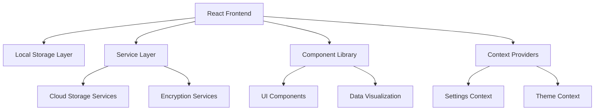

# 🛠️ Biomarkr Developer Guide

Welcome to the Biomarkr developer guide! This document provides comprehensive technical information for contributors and developers working on the Biomarkr codebase.

## 📋 Table of Contents

1. [Architecture Overview](#-architecture-overview)
2. [Project Structure](#-project-structure)  
3. [Development Setup](#-development-setup)
4. [Component Architecture](#-component-architecture)
5. [State Management](#-state-management)
6. [Data Models](#-data-models)
7. [Adding New Features](#-adding-new-features)
8. [Extending Biomarkers](#-extending-biomarkers)
9. [Testing Strategy](#-testing-strategy)
10. [Performance Considerations](#-performance-considerations)
11. [Security Implementation](#-security-implementation)
12. [Deployment & Build](#-deployment--build)

---

## 🏗️ Architecture Overview

### High-Level Architecture



### Core Principles

- **Privacy-First**: All data processing happens locally
- **Zero-Trust Architecture**: Encryption for sensitive data
- **Modular Design**: Loosely coupled components and services
- **Responsive UI**: Mobile-first, progressive enhancement
- **Accessibility**: WCAG 2.1 AA compliance
- **Performance**: Optimized for large datasets

### Technology Stack

#### **Frontend Framework**
- **React 18**: Functional components with hooks
- **TypeScript**: Strict type checking
- **Vite**: Fast development server and build tool
- **Tailwind CSS**: Utility-first styling framework

#### **State Management**
- **React Context**: Global state management
- **useState/useReducer**: Local component state
- **localStorage**: Data persistence layer

#### **UI & Visualization**
- **Lucide React**: Icon library
- **Chart.js + React-Chartjs-2**: Data visualization
- **Custom Components**: Reusable UI components

#### **Build & Development**
- **ESLint**: Code linting and formatting
- **Prettier**: Code formatting
- **TypeScript**: Static type checking
- **Vite**: Module bundling and HMR

---

## 📁 Project Structure

```
biomarkr-app/
├── public/                     # Static assets
│   ├── icons/                 # App icons and favicons
│   └── auth/                  # OAuth callback pages
├── src/
│   ├── components/            # React components
│   │   ├── AddResultWizard.tsx
│   │   ├── AlertModal.tsx
│   │   ├── BackupManager.tsx
│   │   ├── CloudSync.tsx
│   │   ├── Onboarding.tsx
│   │   ├── ProfileManager.tsx
│   │   ├── ResultsList.tsx
│   │   ├── VaultManager.tsx
│   │   └── ...
│   ├── contexts/              # React contexts
│   │   └── SettingsContext.tsx
│   ├── services/             # Business logic services
│   │   ├── cloudStorage.ts
│   │   ├── cloudStorageManager.ts
│   │   ├── dropboxStorage.ts
│   │   ├── googleDriveStorage.ts
│   │   └── oneDriveStorage.ts
│   ├── utils/                # Utility functions
│   │   ├── authHelpers.ts
│   │   ├── draftManager.ts
│   │   ├── providerValidation.ts
│   │   └── unitConversion.ts
│   ├── data/                 # Data models and mock data
│   │   └── mockData.ts
│   ├── App.tsx              # Main application component
│   ├── main.tsx             # Application entry point
│   └── index.css            # Global styles
├── docs/                    # Documentation
├── .github/                # GitHub workflows and templates
└── dist/                   # Build output
```

### Component Organization

Components are organized by functionality:

- **Core Components**: Main application features (App.tsx, Onboarding.tsx)
- **Feature Components**: Specific functionality (AddResultWizard, ProfileManager)
- **Modal Components**: Overlay dialogs (AlertModal, ConfirmModal)
- **Manager Components**: Complex state management (VaultManager, BackupManager)

### Service Layer Organization

- **Storage Services**: Cloud storage integrations
- **Data Services**: Data processing and validation
- **Utility Services**: Helper functions and utilities
- **Security Services**: Encryption and vault management

---

## 🚀 Development Setup

### Prerequisites

- **Node.js 18+**: JavaScript runtime
- **npm**: Package manager
- **Git**: Version control
- **VS Code** (recommended): IDE with TypeScript support

### Initial Setup

```bash
# Clone the repository
git clone https://github.com/your-username/biomarkr-app.git
cd biomarkr-app

# Install dependencies
npm install

# Start development server
npm run dev

# Open another terminal for type checking
npm run type-check:watch
```

### Development Scripts

```bash
# Development
npm run dev                    # Start dev server with HMR
npm run dev:host              # Start dev server accessible on network

# Building
npm run build                 # Production build
npm run preview              # Preview production build

# Code Quality
npm run lint                 # ESLint code checking
npm run lint:fix            # Fix ESLint issues
npm run type-check          # TypeScript type checking
npm run type-check:watch    # Watch mode type checking

# Testing
npm run test                # Run unit tests (future)
npm run test:coverage      # Test coverage report (future)

# Deployment
npm run build:analyze      # Bundle analysis
npm run build:electron     # Electron desktop build
npm run build:capacitor    # Mobile app build
```

### Development Environment

#### Recommended VS Code Extensions

```json
{
  "recommendations": [
    "bradlc.vscode-tailwindcss",
    "ms-vscode.vscode-typescript-next",
    "esbenp.prettier-vscode",
    "ms-vscode.vscode-eslint",
    "formulahendry.auto-rename-tag",
    "christian-kohler.path-intellisense"
  ]
}
```

#### Environment Variables

Create `.env.local` for development:

```env
# Development settings
VITE_DEV_MODE=true
VITE_DEBUG_LOGGING=true

# OAuth credentials (optional for testing)
VITE_GOOGLE_CLIENT_ID=your_google_client_id
VITE_DROPBOX_APP_KEY=your_dropbox_app_key
VITE_ONEDRIVE_CLIENT_ID=your_onedrive_client_id
```

---

## 🧩 Component Architecture

### Component Design Patterns

#### 1. **Functional Components with Hooks**

```typescript
interface ComponentProps {
  data: TestResult[];
  onAction: (id: string) => void;
  className?: string;
}

export function MyComponent({ data, onAction, className = '' }: ComponentProps) {
  const [state, setState] = useState<ComponentState>({});
  
  useEffect(() => {
    // Side effects
  }, [data]);

  const handleAction = useCallback((id: string) => {
    onAction(id);
  }, [onAction]);

  return (
    <div className={`component-base ${className}`}>
      {/* Component JSX */}
    </div>
  );
}
```

#### 2. **Custom Hooks for Logic Separation**

```typescript
// hooks/useTestResults.ts
export function useTestResults(profileId: string) {
  const [results, setResults] = useState<TestResult[]>([]);
  const [loading, setLoading] = useState(true);

  useEffect(() => {
    loadTestResults(profileId).then(setResults);
    setLoading(false);
  }, [profileId]);

  const addResult = useCallback((result: TestResult) => {
    setResults(prev => [...prev, result]);
    saveTestResults([...results, result]);
  }, [results]);

  return { results, loading, addResult };
}
```

#### 3. **Context-Based State Management**

```typescript
// contexts/DataContext.tsx
interface DataContextValue {
  profiles: Profile[];
  testResults: TestResult[];
  reminders: Reminder[];
  addProfile: (profile: Profile) => void;
  updateProfile: (id: string, updates: Partial<Profile>) => void;
}

const DataContext = createContext<DataContextValue | null>(null);

export function DataProvider({ children }: { children: ReactNode }) {
  const [profiles, setProfiles] = useState<Profile[]>([]);
  // ... other state

  const value = useMemo(() => ({
    profiles,
    testResults,
    reminders,
    addProfile,
    updateProfile,
  }), [profiles, testResults, reminders]);

  return (
    <DataContext.Provider value={value}>
      {children}
    </DataContext.Provider>
  );
}

export function useData() {
  const context = useContext(DataContext);
  if (!context) {
    throw new Error('useData must be used within DataProvider');
  }
  return context;
}
```

### Component Patterns

#### Modal Components

```typescript
interface ModalProps {
  isOpen: boolean;
  onClose: () => void;
  title: string;
  children: ReactNode;
}

export function Modal({ isOpen, onClose, title, children }: ModalProps) {
  useEffect(() => {
    const handleEscape = (e: KeyboardEvent) => {
      if (e.key === 'Escape') onClose();
    };

    if (isOpen) {
      document.addEventListener('keydown', handleEscape);
      document.body.style.overflow = 'hidden';
    }

    return () => {
      document.removeEventListener('keydown', handleEscape);
      document.body.style.overflow = 'unset';
    };
  }, [isOpen, onClose]);

  if (!isOpen) return null;

  return (
    <div className="fixed inset-0 z-50 flex items-center justify-center">
      <div className="fixed inset-0 bg-black bg-opacity-50" onClick={onClose} />
      <div className="relative bg-white rounded-lg p-6 max-w-md w-full mx-4">
        <h2 className="text-lg font-semibold mb-4">{title}</h2>
        {children}
      </div>
    </div>
  );
}
```

#### Form Components

```typescript
interface FormFieldProps {
  label: string;
  value: string;
  onChange: (value: string) => void;
  error?: string;
  required?: boolean;
}

export function FormField({ label, value, onChange, error, required }: FormFieldProps) {
  return (
    <div className="form-field">
      <label className="block text-sm font-medium text-gray-700">
        {label} {required && <span className="text-red-500">*</span>}
      </label>
      <input
        type="text"
        value={value}
        onChange={(e) => onChange(e.target.value)}
        className={`mt-1 block w-full rounded-md border-gray-300 shadow-sm ${
          error ? 'border-red-300 focus:border-red-500' : 'focus:border-blue-500'
        }`}
      />
      {error && <p className="mt-1 text-sm text-red-600">{error}</p>}
    </div>
  );
}
```

---

## 🔄 State Management

### Local Storage Integration

```typescript
// utils/storage.ts
export class StorageManager {
  private static instance: StorageManager;
  
  static getInstance(): StorageManager {
    if (!this.instance) {
      this.instance = new StorageManager();
    }
    return this.instance;
  }

  private getStorageKey(key: string): string {
    return `biomarkr-${key}`;
  }

  save<T>(key: string, data: T): void {
    try {
      const serialized = JSON.stringify(data);
      localStorage.setItem(this.getStorageKey(key), serialized);
    } catch (error) {
      console.error('Failed to save to localStorage:', error);
    }
  }

  load<T>(key: string, defaultValue: T): T {
    try {
      const serialized = localStorage.getItem(this.getStorageKey(key));
      return serialized ? JSON.parse(serialized) : defaultValue;
    } catch (error) {
      console.error('Failed to load from localStorage:', error);
      return defaultValue;
    }
  }

  remove(key: string): void {
    localStorage.removeItem(this.getStorageKey(key));
  }
}
```

### Data Persistence Hooks

```typescript
// hooks/usePersistedState.ts
export function usePersistedState<T>(
  key: string,
  defaultValue: T
): [T, (value: T | ((prev: T) => T)) => void] {
  const storage = StorageManager.getInstance();
  
  const [state, setState] = useState<T>(() => {
    return storage.load(key, defaultValue);
  });

  const setPersistedState = useCallback((value: T | ((prev: T) => T)) => {
    setState(prevState => {
      const newState = typeof value === 'function' 
        ? (value as (prev: T) => T)(prevState)
        : value;
      
      storage.save(key, newState);
      return newState;
    });
  }, [key, storage]);

  return [state, setPersistedState];
}
```

### Global State Context

```typescript
// contexts/AppContext.tsx
interface AppState {
  profiles: Profile[];
  activeProfileId: string | null;
  testResults: TestResult[];
  reminders: Reminder[];
  settings: AppSettings;
  isVaultLocked: boolean;
}

interface AppContextValue extends AppState {
  actions: {
    addProfile: (profile: Profile) => void;
    setActiveProfile: (id: string) => void;
    addTestResult: (result: TestResult) => void;
    updateSettings: (settings: Partial<AppSettings>) => void;
    lockVault: () => void;
    unlockVault: (passphrase: string) => Promise<boolean>;
  };
}

export function AppProvider({ children }: { children: ReactNode }) {
  const [state, setState] = usePersistedState<AppState>('app-state', initialState);
  
  const actions = useMemo(() => ({
    addProfile: (profile: Profile) => {
      setState(prev => ({
        ...prev,
        profiles: [...prev.profiles, profile]
      }));
    },
    // ... other actions
  }), [setState]);

  const value = useMemo(() => ({
    ...state,
    actions
  }), [state, actions]);

  return (
    <AppContext.Provider value={value}>
      {children}
    </AppContext.Provider>
  );
}
```

---

## 📊 Data Models

### Core Data Types

```typescript
// types/index.ts

export interface Profile {
  id: string;
  name: string;
  relationship: 'self' | 'spouse' | 'child' | 'parent' | 'other';
  dateOfBirth: string;
  gender: 'male' | 'female' | 'other';
  height?: string;
  weight?: string;
  notes?: string;
  createdAt: string;
  modifiedAt?: string;
  isDefault?: boolean;
}

export interface TestResult {
  id: string;
  profileId: string;
  profileName?: string;
  date: string;
  time?: string;
  lab: string;
  panel: string;
  tags?: string[];
  notes?: string;
  createdAt: string;
  modifiedAt?: string;
  biomarkers: Biomarker[];
}

export interface Biomarker {
  name: string;
  value: string;
  unit: string;
  range?: string;
  referenceRange?: {
    min?: number;
    max?: number;
    text?: string;
  };
  flags?: string[];
  notes?: string;
}

export interface Reminder {
  id: string;
  profileId: string;
  title: string;
  description: string;
  dueDate: string;
  frequency: 'once' | 'daily' | 'weekly' | 'monthly' | 'yearly';
  isCompleted: boolean;
  category: 'test' | 'medication' | 'appointment' | 'lifestyle';
  createdAt: string;
  completedAt?: string;
}

export interface AppSettings {
  theme: 'light' | 'dark' | 'auto';
  notifications: {
    email: boolean;
    push: boolean;
    sms: boolean;
  };
  privacy: {
    shareData: boolean;
    analytics: boolean;
  };
  vault: {
    enabled: boolean;
    autoLockMinutes: number;
  };
  backup: {
    autoBackup: boolean;
    frequency: 'daily' | 'weekly' | 'monthly';
    provider?: 'google' | 'dropbox' | 'onedrive';
  };
}
```

### Data Validation

```typescript
// utils/validation.ts
import { z } from 'zod';

export const ProfileSchema = z.object({
  id: z.string(),
  name: z.string().min(1, 'Name is required'),
  relationship: z.enum(['self', 'spouse', 'child', 'parent', 'other']),
  dateOfBirth: z.string().regex(/^\d{4}-\d{2}-\d{2}$/, 'Invalid date format'),
  gender: z.enum(['male', 'female', 'other']),
  height: z.string().optional(),
  weight: z.string().optional(),
  notes: z.string().optional(),
  createdAt: z.string(),
  modifiedAt: z.string().optional(),
  isDefault: z.boolean().optional(),
});

export const BiomarkerSchema = z.object({
  name: z.string().min(1, 'Biomarker name is required'),
  value: z.string().min(1, 'Value is required'),
  unit: z.string().min(1, 'Unit is required'),
  range: z.string().optional(),
  referenceRange: z.object({
    min: z.number().optional(),
    max: z.number().optional(),
    text: z.string().optional(),
  }).optional(),
  flags: z.array(z.string()).optional(),
  notes: z.string().optional(),
});

export function validateProfile(profile: unknown): Profile {
  return ProfileSchema.parse(profile);
}

export function validateBiomarker(biomarker: unknown): Biomarker {
  return BiomarkerSchema.parse(biomarker);
}
```

---

## ✨ Adding New Features

### Feature Development Workflow

1. **Design**: Create component mockups and define interfaces
2. **Implementation**: Build components following established patterns
3. **Integration**: Connect to state management and persistence
4. **Testing**: Manual testing in demo mode
5. **Documentation**: Update relevant documentation

### Example: Adding a New Biomarker Panel

#### Step 1: Define the Panel Structure

```typescript
// data/panels/cardiovascularAdvanced.ts
export const cardiovascularAdvancedPanel = {
  name: 'Advanced Cardiovascular Panel',
  category: 'cardiovascular',
  biomarkers: [
    {
      name: 'Apolipoprotein A1',
      unit: 'mg/dL',
      referenceRange: { min: 120, max: 160, text: '120-160 mg/dL' },
      description: 'Main protein component of HDL cholesterol'
    },
    {
      name: 'Apolipoprotein B',
      unit: 'mg/dL', 
      referenceRange: { text: '<100 mg/dL' },
      description: 'Main protein component of LDL cholesterol'
    },
    {
      name: 'Lp(a)',
      unit: 'mg/dL',
      referenceRange: { text: '<30 mg/dL' },
      description: 'Lipoprotein(a) - genetic cardiovascular risk factor'
    }
  ]
};
```

#### Step 2: Add to Mock Data Generator

```typescript
// data/mockData.ts
case 'Advanced Cardiovascular Panel':
  biomarkers = [
    { 
      name: 'Apolipoprotein A1', 
      value: (120 + Math.random() * 40).toFixed(0), 
      unit: 'mg/dL', 
      referenceRange: { min: 120, max: 160 }, 
      range: '120-160 mg/dL' 
    },
    { 
      name: 'Apolipoprotein B', 
      value: (60 + Math.random() * 40).toFixed(0), 
      unit: 'mg/dL', 
      referenceRange: { text: '<100 mg/dL' }, 
      range: '<100 mg/dL' 
    },
    { 
      name: 'Lp(a)', 
      value: (5 + Math.random() * 35).toFixed(0), 
      unit: 'mg/dL', 
      referenceRange: { text: '<30 mg/dL' }, 
      range: '<30 mg/dL' 
    }
  ];
  break;
```

#### Step 3: Update Panel Selection UI

```typescript
// components/AddResultWizard.tsx
const testPanels = [
  // ... existing panels
  'Advanced Cardiovascular Panel',
];

const panelDescriptions = {
  // ... existing descriptions
  'Advanced Cardiovascular Panel': 'Advanced lipid and cardiovascular risk markers including Apo A1, Apo B, and Lp(a)'
};
```

#### Step 4: Add Documentation

Update `HEALTH_METRICS.md` with the new panel information and clinical significance.

### Feature Integration Checklist

- [ ] Component follows established patterns
- [ ] TypeScript interfaces defined
- [ ] State management integrated
- [ ] Data persistence working
- [ ] Responsive design implemented
- [ ] Accessibility considerations
- [ ] Error handling implemented
- [ ] Loading states handled
- [ ] Demo data updated
- [ ] Documentation updated

---

## 🧪 Extending Biomarkers

### Adding New Biomarker Categories

#### 1. Define Biomarker Interfaces

```typescript
// types/biomarkers.ts
export interface BiomarkerDefinition {
  name: string;
  unit: string;
  category: string;
  normalRange?: {
    min?: number;
    max?: number;
    text?: string;
  };
  criticalRange?: {
    min?: number;
    max?: number;
  };
  description: string;
  clinicalSignificance: string;
  relatedBiomarkers?: string[];
  ageVariations?: {
    ageGroup: string;
    normalRange: { min?: number; max?: number; text?: string };
  }[];
  genderVariations?: {
    gender: 'male' | 'female';
    normalRange: { min?: number; max?: number; text?: string };
  }[];
}
```

#### 2. Create Biomarker Registry

```typescript
// data/biomarkerRegistry.ts
export const biomarkerRegistry: Record<string, BiomarkerDefinition> = {
  'C-Reactive Protein': {
    name: 'C-Reactive Protein',
    unit: 'mg/L',
    category: 'inflammatory',
    normalRange: { text: '<3.0 mg/L' },
    criticalRange: { min: 10 },
    description: 'Marker of systemic inflammation',
    clinicalSignificance: 'Elevated levels indicate inflammation and increased cardiovascular risk',
    relatedBiomarkers: ['ESR', 'White Blood Cells'],
  },
  // ... more biomarkers
};

export function getBiomarkerDefinition(name: string): BiomarkerDefinition | null {
  return biomarkerRegistry[name] || null;
}

export function getBiomarkersByCategory(category: string): BiomarkerDefinition[] {
  return Object.values(biomarkerRegistry).filter(b => b.category === category);
}
```

#### 3. Create Reference Range Calculator

```typescript
// utils/referenceRanges.ts
export function calculateReferenceRange(
  biomarker: string,
  age: number,
  gender: 'male' | 'female' | 'other'
): { min?: number; max?: number; text?: string } | null {
  const definition = getBiomarkerDefinition(biomarker);
  if (!definition) return null;

  // Check for age-specific ranges
  if (definition.ageVariations) {
    for (const variation of definition.ageVariations) {
      if (isAgeInGroup(age, variation.ageGroup)) {
        return variation.normalRange;
      }
    }
  }

  // Check for gender-specific ranges
  if (definition.genderVariations && gender !== 'other') {
    const genderVariation = definition.genderVariations.find(v => v.gender === gender);
    if (genderVariation) {
      return genderVariation.normalRange;
    }
  }

  return definition.normalRange || null;
}

function isAgeInGroup(age: number, ageGroup: string): boolean {
  // Parse age group strings like "18-65", "65+", "0-18"
  const ranges = ageGroup.split('-');
  if (ranges.length === 2) {
    const min = parseInt(ranges[0]);
    const max = ranges[1] === '+' ? Infinity : parseInt(ranges[1]);
    return age >= min && age <= max;
  }
  return false;
}
```

#### 4. Implement Smart Validation

```typescript
// utils/biomarkerValidation.ts
export interface ValidationResult {
  isValid: boolean;
  severity: 'normal' | 'borderline' | 'abnormal' | 'critical';
  message?: string;
  trend?: 'improving' | 'stable' | 'worsening';
}

export function validateBiomarkerValue(
  biomarker: string,
  value: string,
  age: number,
  gender: 'male' | 'female' | 'other',
  previousValues?: { value: string; date: string }[]
): ValidationResult {
  const numericValue = parseFloat(value);
  if (isNaN(numericValue)) {
    return { isValid: false, severity: 'normal', message: 'Invalid numeric value' };
  }

  const referenceRange = calculateReferenceRange(biomarker, age, gender);
  const definition = getBiomarkerDefinition(biomarker);
  
  if (!referenceRange || !definition) {
    return { isValid: true, severity: 'normal' };
  }

  let severity: ValidationResult['severity'] = 'normal';
  let message: string | undefined;

  // Check critical ranges first
  if (definition.criticalRange) {
    if (definition.criticalRange.min && numericValue < definition.criticalRange.min) {
      severity = 'critical';
      message = 'Critically low value - seek immediate medical attention';
    } else if (definition.criticalRange.max && numericValue > definition.criticalRange.max) {
      severity = 'critical';
      message = 'Critically high value - seek immediate medical attention';
    }
  }

  // Check normal ranges
  if (severity === 'normal') {
    if (referenceRange.min && numericValue < referenceRange.min) {
      severity = 'abnormal';
      message = 'Below normal range';
    } else if (referenceRange.max && numericValue > referenceRange.max) {
      severity = 'abnormal';
      message = 'Above normal range';
    }
  }

  // Calculate trend if previous values available
  let trend: ValidationResult['trend'] | undefined;
  if (previousValues && previousValues.length > 0) {
    const lastValue = parseFloat(previousValues[previousValues.length - 1].value);
    if (!isNaN(lastValue)) {
      const change = ((numericValue - lastValue) / lastValue) * 100;
      if (Math.abs(change) > 5) { // 5% threshold
        trend = change > 0 ? 'worsening' : 'improving';
        // Note: 'improving' vs 'worsening' depends on biomarker context
      } else {
        trend = 'stable';
      }
    }
  }

  return {
    isValid: true,
    severity,
    message,
    trend
  };
}
```

---

## 🧪 Testing Strategy

### Testing Philosophy

- **Manual Testing**: Comprehensive user testing in demo mode
- **Unit Testing**: Critical business logic and utilities
- **Integration Testing**: Component interaction testing
- **End-to-End Testing**: Full user workflow testing

### Unit Testing Setup

```typescript
// __tests__/utils/biomarkerValidation.test.ts
import { describe, it, expect } from 'vitest';
import { validateBiomarkerValue } from '../utils/biomarkerValidation';

describe('biomarkerValidation', () => {
  it('should validate normal glucose levels', () => {
    const result = validateBiomarkerValue('Glucose', '85', 35, 'male');
    
    expect(result.isValid).toBe(true);
    expect(result.severity).toBe('normal');
    expect(result.message).toBeUndefined();
  });

  it('should flag high glucose levels', () => {
    const result = validateBiomarkerValue('Glucose', '150', 35, 'male');
    
    expect(result.isValid).toBe(true);
    expect(result.severity).toBe('abnormal');
    expect(result.message).toBe('Above normal range');
  });

  it('should detect improving trends', () => {
    const previousValues = [
      { value: '200', date: '2024-01-01' },
      { value: '180', date: '2024-02-01' }
    ];
    
    const result = validateBiomarkerValue('Glucose', '150', 35, 'male', previousValues);
    
    expect(result.trend).toBe('improving');
  });
});
```

### Component Testing

```typescript
// __tests__/components/ProfileManager.test.tsx
import { render, screen, fireEvent } from '@testing-library/react';
import { ProfileManager } from '../components/ProfileManager';
import { AppProvider } from '../contexts/AppContext';

describe('ProfileManager', () => {
  it('should render profile list', () => {
    render(
      <AppProvider>
        <ProfileManager />
      </AppProvider>
    );

    expect(screen.getByText('Manage Profiles')).toBeInTheDocument();
  });

  it('should open add profile modal', () => {
    render(
      <AppProvider>
        <ProfileManager />
      </AppProvider>
    );

    fireEvent.click(screen.getByText('Add Profile'));
    expect(screen.getByText('Create New Profile')).toBeInTheDocument();
  });
});
```

### Manual Testing Checklist

#### Core Functionality
- [ ] Profile creation, editing, deletion
- [ ] Test result entry with various biomarkers
- [ ] Trend visualization with multiple data points
- [ ] Reminder creation and management
- [ ] Data export (PDF, CSV, JSON)
- [ ] Vault lock/unlock functionality

#### Edge Cases
- [ ] Large datasets (100+ test results)
- [ ] Empty states (no profiles, no data)
- [ ] Invalid data entry handling
- [ ] Browser storage limits
- [ ] Network connectivity issues (for cloud sync)

#### Cross-Browser Testing
- [ ] Chrome (latest)
- [ ] Firefox (latest)
- [ ] Safari (latest)
- [ ] Edge (latest)
- [ ] Mobile browsers (iOS Safari, Chrome Android)

#### Accessibility Testing
- [ ] Keyboard navigation
- [ ] Screen reader compatibility
- [ ] Color contrast ratios
- [ ] Focus indicators
- [ ] ARIA labels and descriptions

---

## ⚡ Performance Considerations

### Optimization Strategies

#### 1. **React Performance**

```typescript
// Use React.memo for expensive components
export const ExpensiveComponent = React.memo(({ data }: Props) => {
  return <div>{/* Expensive rendering */}</div>;
});

// Use useMemo for expensive calculations
function TrendAnalysis({ testResults }: Props) {
  const trendData = useMemo(() => {
    return calculateTrends(testResults); // Expensive calculation
  }, [testResults]);

  return <Chart data={trendData} />;
}

// Use useCallback for stable function references
function ResultsList({ results, onEdit }: Props) {
  const handleEdit = useCallback((id: string) => {
    onEdit(id);
  }, [onEdit]);

  return (
    <div>
      {results.map(result => (
        <ResultItem key={result.id} result={result} onEdit={handleEdit} />
      ))}
    </div>
  );
}
```

#### 2. **Data Management**

```typescript
// Implement data pagination for large datasets
export function usePaginatedResults(allResults: TestResult[], pageSize = 20) {
  const [currentPage, setCurrentPage] = useState(1);
  
  const paginatedResults = useMemo(() => {
    const startIndex = (currentPage - 1) * pageSize;
    const endIndex = startIndex + pageSize;
    return allResults.slice(startIndex, endIndex);
  }, [allResults, currentPage, pageSize]);

  const totalPages = Math.ceil(allResults.length / pageSize);

  return {
    results: paginatedResults,
    currentPage,
    totalPages,
    setCurrentPage,
    hasNextPage: currentPage < totalPages,
    hasPreviousPage: currentPage > 1
  };
}

// Implement virtual scrolling for very large lists
export function VirtualizedResultsList({ results }: Props) {
  const [startIndex, setStartIndex] = useState(0);
  const [endIndex, setEndIndex] = useState(20);
  
  const visibleResults = useMemo(() => {
    return results.slice(startIndex, endIndex);
  }, [results, startIndex, endIndex]);

  return (
    <div className="virtual-list">
      {visibleResults.map(result => (
        <ResultItem key={result.id} result={result} />
      ))}
    </div>
  );
}
```

#### 3. **Storage Optimization**

```typescript
// Implement data compression for large datasets
import { compress, decompress } from 'lz-string';

export class OptimizedStorage extends StorageManager {
  save<T>(key: string, data: T): void {
    try {
      const serialized = JSON.stringify(data);
      const compressed = compress(serialized);
      localStorage.setItem(this.getStorageKey(key), compressed);
    } catch (error) {
      console.error('Failed to save compressed data:', error);
      // Fallback to uncompressed
      super.save(key, data);
    }
  }

  load<T>(key: string, defaultValue: T): T {
    try {
      const compressed = localStorage.getItem(this.getStorageKey(key));
      if (!compressed) return defaultValue;
      
      const decompressed = decompress(compressed);
      return decompressed ? JSON.parse(decompressed) : defaultValue;
    } catch (error) {
      console.error('Failed to load compressed data:', error);
      return super.load(key, defaultValue);
    }
  }
}
```

#### 4. **Bundle Optimization**

```typescript
// vite.config.ts
export default defineConfig({
  build: {
    rollupOptions: {
      output: {
        manualChunks: {
          vendor: ['react', 'react-dom'],
          charts: ['chart.js', 'react-chartjs-2'],
          utils: ['date-fns', 'lodash-es'],
        }
      }
    }
  }
});

// Lazy load heavy components
const ChartComponent = lazy(() => import('./components/ChartComponent'));

function App() {
  return (
    <Suspense fallback={<div>Loading chart...</div>}>
      <ChartComponent />
    </Suspense>
  );
}
```

### Performance Monitoring

```typescript
// utils/performance.ts
export function measurePerformance<T>(
  name: string,
  fn: () => T
): T {
  const start = performance.now();
  const result = fn();
  const end = performance.now();
  
  console.log(`${name} took ${end - start} milliseconds`);
  return result;
}

export function usePerformanceMonitor(componentName: string) {
  useEffect(() => {
    const start = performance.now();
    
    return () => {
      const end = performance.now();
      console.log(`${componentName} render took ${end - start}ms`);
    };
  });
}
```

---

## 🔐 Security Implementation

### Vault Encryption System

```typescript
// services/encryption.ts
export class EncryptionService {
  private static instance: EncryptionService;
  
  static getInstance(): EncryptionService {
    if (!this.instance) {
      this.instance = new EncryptionService();
    }
    return this.instance;
  }

  async deriveKey(passphrase: string, salt: Uint8Array): Promise<CryptoKey> {
    const encoder = new TextEncoder();
    const passphraseBuffer = encoder.encode(passphrase);
    
    // Import the passphrase as a key
    const baseKey = await crypto.subtle.importKey(
      'raw',
      passphraseBuffer,
      'PBKDF2',
      false,
      ['deriveKey']
    );
    
    // Derive the encryption key
    return crypto.subtle.deriveKey(
      {
        name: 'PBKDF2',
        salt,
        iterations: 100000,
        hash: 'SHA-256'
      },
      baseKey,
      { name: 'AES-GCM', length: 256 },
      false,
      ['encrypt', 'decrypt']
    );
  }

  async encrypt(data: string, passphrase: string): Promise<string> {
    const encoder = new TextEncoder();
    const dataBuffer = encoder.encode(data);
    
    // Generate random salt and IV
    const salt = crypto.getRandomValues(new Uint8Array(16));
    const iv = crypto.getRandomValues(new Uint8Array(12));
    
    // Derive encryption key
    const key = await this.deriveKey(passphrase, salt);
    
    // Encrypt the data
    const encryptedBuffer = await crypto.subtle.encrypt(
      { name: 'AES-GCM', iv },
      key,
      dataBuffer
    );
    
    // Combine salt, iv, and encrypted data
    const result = new Uint8Array(salt.length + iv.length + encryptedBuffer.byteLength);
    result.set(salt, 0);
    result.set(iv, salt.length);
    result.set(new Uint8Array(encryptedBuffer), salt.length + iv.length);
    
    // Convert to base64 for storage
    return btoa(String.fromCharCode(...result));
  }

  async decrypt(encryptedData: string, passphrase: string): Promise<string> {
    // Convert from base64
    const encryptedBuffer = new Uint8Array(
      atob(encryptedData).split('').map(char => char.charCodeAt(0))
    );
    
    // Extract salt, IV, and encrypted data
    const salt = encryptedBuffer.slice(0, 16);
    const iv = encryptedBuffer.slice(16, 28);
    const data = encryptedBuffer.slice(28);
    
    // Derive decryption key
    const key = await this.deriveKey(passphrase, salt);
    
    // Decrypt the data
    const decryptedBuffer = await crypto.subtle.decrypt(
      { name: 'AES-GCM', iv },
      key,
      data
    );
    
    // Convert back to string
    const decoder = new TextDecoder();
    return decoder.decode(decryptedBuffer);
  }
}
```

### Secure Storage Manager

```typescript
// services/secureStorage.ts
export class SecureStorageManager extends StorageManager {
  private encryptionService = EncryptionService.getInstance();
  private sessionKey: string | null = null;

  async unlock(passphrase: string): Promise<boolean> {
    try {
      // Test decryption with a known encrypted value
      const testData = this.loadEncrypted('vault-test', null);
      if (testData) {
        await this.encryptionService.decrypt(testData, passphrase);
      }
      
      this.sessionKey = passphrase;
      return true;
    } catch (error) {
      return false;
    }
  }

  lock(): void {
    this.sessionKey = null;
  }

  isUnlocked(): boolean {
    return this.sessionKey !== null;
  }

  async saveEncrypted<T>(key: string, data: T): Promise<void> {
    if (!this.sessionKey) {
      throw new Error('Vault is locked');
    }

    try {
      const serialized = JSON.stringify(data);
      const encrypted = await this.encryptionService.encrypt(serialized, this.sessionKey);
      localStorage.setItem(this.getStorageKey(key), encrypted);
    } catch (error) {
      console.error('Failed to save encrypted data:', error);
      throw error;
    }
  }

  async loadEncrypted<T>(key: string, defaultValue: T): Promise<T> {
    if (!this.sessionKey) {
      throw new Error('Vault is locked');
    }

    try {
      const encrypted = localStorage.getItem(this.getStorageKey(key));
      if (!encrypted) return defaultValue;
      
      const decrypted = await this.encryptionService.decrypt(encrypted, this.sessionKey);
      return JSON.parse(decrypted);
    } catch (error) {
      console.error('Failed to load encrypted data:', error);
      return defaultValue;
    }
  }

  private loadEncrypted<T>(key: string, defaultValue: T | null): string | null {
    return localStorage.getItem(this.getStorageKey(key));
  }
}
```

### Auto-Lock Implementation

```typescript
// hooks/useAutoLock.ts
export function useAutoLock(timeoutMinutes: number = 15) {
  const [isLocked, setIsLocked] = useState(false);
  const timeoutRef = useRef<NodeJS.Timeout>();
  const storage = SecureStorageManager.getInstance();

  const resetTimeout = useCallback(() => {
    if (timeoutRef.current) {
      clearTimeout(timeoutRef.current);
    }

    timeoutRef.current = setTimeout(() => {
      storage.lock();
      setIsLocked(true);
    }, timeoutMinutes * 60 * 1000);
  }, [timeoutMinutes, storage]);

  useEffect(() => {
    const events = ['mousedown', 'mousemove', 'keypress', 'scroll', 'touchstart'];
    
    const resetTimeoutHandler = () => {
      if (!isLocked) {
        resetTimeout();
      }
    };

    events.forEach(event => {
      document.addEventListener(event, resetTimeoutHandler, true);
    });

    resetTimeout();

    return () => {
      if (timeoutRef.current) {
        clearTimeout(timeoutRef.current);
      }
      
      events.forEach(event => {
        document.removeEventListener(event, resetTimeoutHandler, true);
      });
    };
  }, [isLocked, resetTimeout]);

  const unlock = useCallback(async (passphrase: string) => {
    const success = await storage.unlock(passphrase);
    if (success) {
      setIsLocked(false);
      resetTimeout();
    }
    return success;
  }, [storage, resetTimeout]);

  return { isLocked, unlock };
}
```

---

## 🚀 Deployment & Build

### Build Configuration

```typescript
// vite.config.ts
import { defineConfig } from 'vite';
import react from '@vitejs/plugin-react';
import { resolve } from 'path';

export default defineConfig({
  plugins: [react()],
  build: {
    outDir: 'dist',
    sourcemap: true,
    rollupOptions: {
      output: {
        manualChunks: {
          vendor: ['react', 'react-dom'],
          charts: ['chart.js', 'react-chartjs-2'],
          icons: ['lucide-react']
        }
      }
    }
  },
  resolve: {
    alias: {
      '@': resolve(__dirname, 'src'),
      '@components': resolve(__dirname, 'src/components'),
      '@services': resolve(__dirname, 'src/services'),
      '@utils': resolve(__dirname, 'src/utils'),
      '@types': resolve(__dirname, 'src/types')
    }
  },
  server: {
    port: 5173,
    host: true
  }
});
```

### GitHub Actions Workflow

```yaml
# .github/workflows/deploy.yml
name: Deploy to GitHub Pages

on:
  push:
    branches: [ main ]
  pull_request:
    branches: [ main ]

jobs:
  build-and-deploy:
    runs-on: ubuntu-latest
    
    steps:
    - name: Checkout
      uses: actions/checkout@v4
      
    - name: Setup Node.js
      uses: actions/setup-node@v4
      with:
        node-version: '18'
        cache: 'npm'
        
    - name: Install dependencies
      run: npm ci
      
    - name: Type check
      run: npm run type-check
      
    - name: Lint
      run: npm run lint
      
    - name: Build
      run: npm run build
      
    - name: Deploy to GitHub Pages
      uses: peaceiris/actions-gh-pages@v3
      if: github.ref == 'refs/heads/main'
      with:
        github_token: ${{ secrets.GITHUB_TOKEN }}
        publish_dir: ./dist
```

### Docker Configuration

```dockerfile
# Dockerfile
FROM node:18-alpine as builder

WORKDIR /app
COPY package*.json ./
RUN npm ci --only=production

COPY . .
RUN npm run build

FROM nginx:alpine
COPY --from=builder /app/dist /usr/share/nginx/html
COPY nginx.conf /etc/nginx/nginx.conf

EXPOSE 80
CMD ["nginx", "-g", "daemon off;"]
```

```nginx
# nginx.conf
events {
    worker_connections 1024;
}

http {
    include /etc/nginx/mime.types;
    default_type application/octet-stream;
    
    server {
        listen 80;
        server_name localhost;
        root /usr/share/nginx/html;
        index index.html;
        
        # Handle React Router
        location / {
            try_files $uri $uri/ /index.html;
        }
        
        # Security headers
        add_header X-Frame-Options DENY;
        add_header X-Content-Type-Options nosniff;
        add_header X-XSS-Protection "1; mode=block";
        add_header Referrer-Policy strict-origin-when-cross-origin;
        
        # Cache static assets
        location ~* \.(js|css|png|jpg|jpeg|gif|svg|ico)$ {
            expires 1y;
            add_header Cache-Control "public, immutable";
        }
    }
}
```

### Environment-Specific Builds

```json
// package.json
{
  "scripts": {
    "build": "vite build",
    "build:staging": "vite build --mode staging",
    "build:production": "vite build --mode production",
    "build:analyze": "npm run build && npx vite-bundle-analyzer dist"
  }
}
```

```env
# .env.production
VITE_APP_TITLE=Biomarkr
VITE_API_URL=https://api.biomarkr.com
VITE_ENABLE_ANALYTICS=true

# .env.staging  
VITE_APP_TITLE=Biomarkr (Staging)
VITE_API_URL=https://staging-api.biomarkr.com
VITE_ENABLE_ANALYTICS=false
```

---

## 📚 Additional Resources

### Code Style Guide

- **TypeScript**: Use strict mode, explicit return types for functions
- **React**: Functional components, hooks, memo optimization
- **CSS**: Tailwind utility classes, avoid custom CSS
- **Naming**: PascalCase for components, camelCase for functions
- **File Structure**: Group related files, barrel exports

### Useful Tools and Libraries

#### Development
- **VS Code**: Recommended IDE with extensions
- **React Developer Tools**: Browser extension for debugging
- **TypeScript**: Static type checking
- **ESLint/Prettier**: Code quality and formatting

#### Production
- **Vite**: Fast build tool and dev server
- **Chart.js**: Data visualization library
- **Tailwind CSS**: Utility-first CSS framework
- **Web Crypto API**: Built-in encryption support

### Documentation Standards

- **README**: Project overview and quick start
- **API Docs**: Function signatures and examples
- **User Guide**: End-user documentation
- **Developer Guide**: Technical implementation details
- **Changelog**: Version history and breaking changes

### Contribution Guidelines

- **Issue Templates**: Bug reports and feature requests
- **PR Templates**: Structured pull request descriptions
- **Code of Conduct**: Community guidelines
- **Security Policy**: Vulnerability reporting process

---

*This developer guide is a living document. Please keep it updated as the project evolves and new patterns emerge.*
